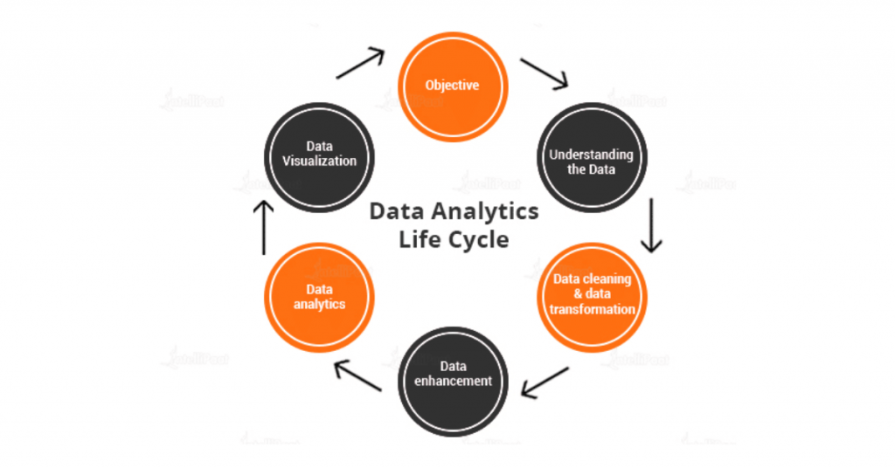
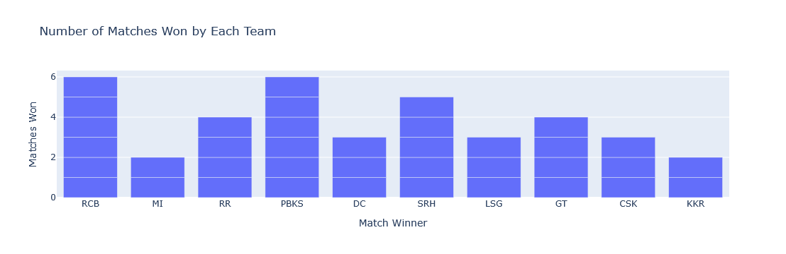
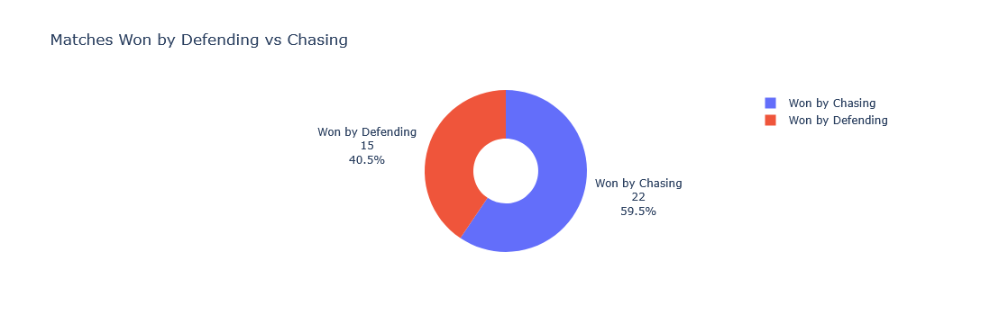
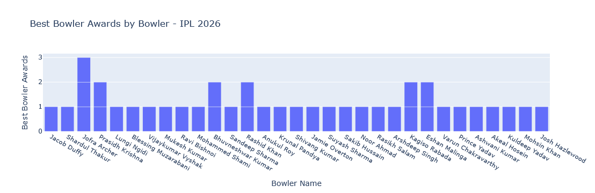
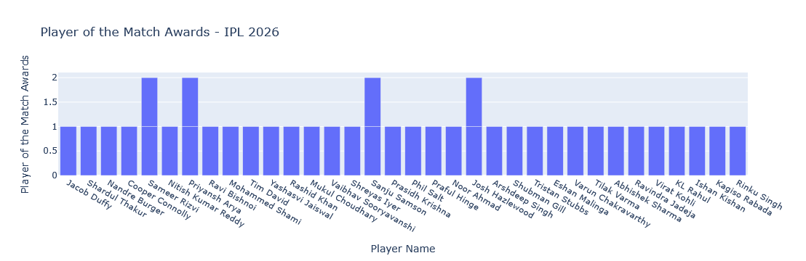
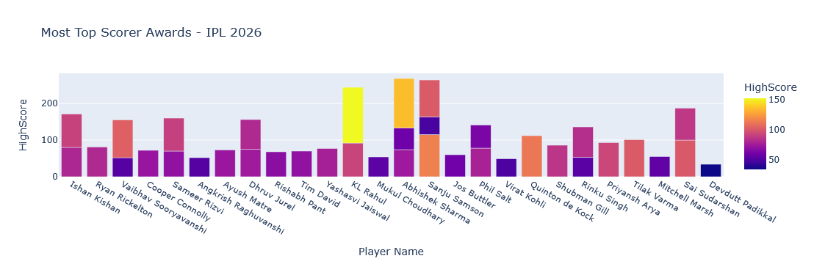

# IPL 2026 Analysis — First 39 Matches Using Python

<p align="center">
  
</p>


---

## Project Overview

A beginner-level Exploratory Data Analysis (EDA) project built while learning Python for Data Analytics. The dataset contains records from the first 39 matches of IPL 2026 and is analyzed using core Python libraries.

The project is structured around the **Data Analytics Life Cycle**:

```
Objective → Understanding the Data → Data Cleaning & Transformation → Data Analysis → Data Visualization → Insights
```

---

## Objective

- Analyze team performances during the first 39 matches of IPL 2026
- Identify the teams with the highest number of wins
- Compare matches won while defending and chasing
- Discover players with the most Player of the Match awards
- Analyze top-scoring batters
- Examine the best bowling performances

---

## Dataset

| Field       | Details                         |
|-------------|---------------------------------|
| Source      | [kaggle](https://www.kaggle.com/) |
| File        | `1-39_Record_Dataset-IPL2026.csv`            |
| Records     | 39                              |
| Columns     | 23                              |
| Tournament     | IPL 2026                     |
| Matches Covered     | First 39 Matches        |

**Column Reference:**

| Column | Description |
|---------|-------------|
| `Match ID` | Unique Match Identifier |
| `Match Date` | Date of Match |
| `Venue` | Match Venue |
| `Team 1` | First Team |
| `Team 2` | Second Team |
| `Stage` | Tournament Stage |
| `Toss Winner` | Team Winning Toss |
| `Toss Decision` | Bat/Bowl Choice |
| `First Innings Score` | Team Batting First Score |
| `First Innings Wickets` | Wickets Lost in First Innings |
| `Second Innings Score` | Team Batting Second Score |
| `Second Innings Wickets` | Wickets Lost in Second Innings |
| `Match Result` | Final Result of the Match |
| `Match Winner` | Winning Team |
| `Win By Runs` | Victory Margin (Runs) |
| `Win By Wickets` | Victory Margin (Wickets) |
| `Balls Left` | Balls Remaining When Chasing Team Won |
| `Player Of The Match` | Match Award Winner |
| `Top Scorer` | Highest Scorer |
| `High Score` | Highest Individual Score |
| `Best Bowling` | Best Bowling Performer |
| `Best Bowling Figure` | Bowling Figures |
| `Super Over Match` | Super Over Status |


---

## Libraries Used

```python
import pandas as pd               # Data loading, cleaning, exploration
import plotly.express as px       # Interactive charts and visualizations
import plotly.graph_objects as go # Custom graph objects
```

---

## What I Learned

**Plotly Express**
- Creating interactive bar charts using `plotly.express`
- Visualizing team wins, player awards, and top scorers
- Customizing chart titles and labels

**Plotly Graph Objects**
- Creating donut charts using `plotly.graph_objects`
- Comparing matches won by defending and chasing

**EDA Concepts**
- Understanding a sports dataset
- Analyzing team and player performances
- Deriving insights through data visualization

---

## Analysis and Visualizations

### 1. Number of Matches Won by Each Team

Bar chart showing total matches won by each IPL team.
<p align="center">
  
</p>

**Insight:** RCB and PBKS emerged as the most successful teams with 6 victories each during the first 39 matches.

---

### 2. Defending vs Chasing Wins

Donut chart comparing matches won while defending a target versus chasing.
<p align="center">
  
</p>

**Insight:** The chart highlights whether batting first or chasing provided a greater advantage during the tournament.
---

### 3. Best Bowling Performances
Bar chart displaying bowlers with the highest number of best bowling performances.
<p align="center">
  
</p>

**Insight:** Jofra Archer recorded the highest number of standout bowling performances, earning recognition 3 times.
---

### 4. Player of the Match Awards

Bar chart comparing Player of the Match award winners.
<p align="center">
  
</p>

**Insight:** Priyansh Arya, Sameer Rizvi, Sanju Samson, and Josh Hazlewood were among the most influential players with multiple awards.
---

### 5. Top Scorer Analysis

Bar chart showing players who finished as top scorers across matches.
<p align="center">
  
</p>

**Insight:** Sanju Samson and Abhishek Sharma emerged as the most frequent top scorers, each achieving the feat three times.

---

## Project Structure

```
Python_Data_Analysis_Mini_Project-2/
|
|-- images/
|   |-- Life_cycle.png                   # Life cycle image
|   |-- team_wins.png                    # Bar chart — Matches Won by Each Team
|   |-- defending_vs_chasing.png         # Donut chart — Defending vs Chasing Wins
|   |-- best_bowler.png                  # Bar chart — Best Bowling Performances
|   |-- player_of_match.png              # Bar chart — Player of the Match Awards
|   |-- top_scorer.png                   # Bar chart — Top Scorer Analysis
|
|-- 1-39_Record_Dataset-IPL2026.csv      # IPL 2026 Dataset (First 39 Matches)
|-- IPL_2026_Analysis_First_39_Matches.ipynb # Main jupyter notebook file
|-- README.md                            # Project Documentation
```

---

---

## Author

**Sai Halwai**  
B.Sc. Computer Science — Game Design & Development  
Shree SaiBaba College, Shirdi

- Email: saihalwai01@gmail.com  
- GitHub: [SAI01-05](https://github.com/SAI01-05)  

---

*This is a learning project built while exploring Python for Data Analytics. More projects coming soon.*
